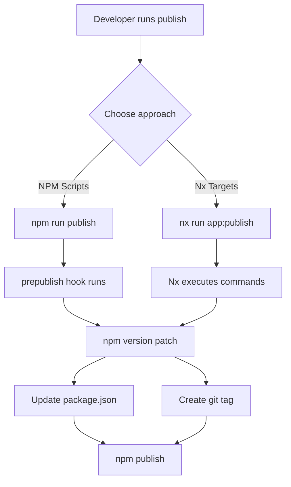

# Design Document

> **Implementation Note**: This design was superseded during implementation. We built a superior solution using **Nx Release with independent versioning** instead of the manual approach described here. See [IMPLEMENTATION_NOTES.md](./IMPLEMENTATION_NOTES.md) for details on what was actually built.

## Original Design Overview

The automated version management system uses simple npm scripts and Nx targets to provide version bumping capabilities. The approach leverages standard Node.js tooling (npm version) combined with Nx's run-commands executor for a minimal, maintainable solution.

## Architecture

The system uses two simple approaches:

1. **NPM Scripts Approach**: Add scripts directly to each app's package.json
2. **Nx Targets Approach**: Use Nx run-commands executor to execute npm commands



## Components and Interfaces

### NPM Scripts Approach

Each app's `package.json` includes these scripts:

```json
{
  "scripts": {
    "bump": "npm version patch",
    "prepublish": "npm run bump", 
    "publish": "npm run prepublish && npm publish"
  }
}
```

**How it works:**
- `npm run publish` automatically bumps version and publishes
- `bump` script can be changed to `minor` or `major` as needed
- `npm version` automatically creates git tags and commits
- Version can be referenced in code: `const { version } = require('./package.json')`

### Nx Targets Approach

Each app's `project.json` includes this target:

```json
{
  "targets": {
    "publish": {
      "executor": "nx:run-commands",
      "options": {
        "command": "npm version patch && npm publish",
        "cwd": "apps/{projectName}"
      }
    }
  }
}
```

**Usage:**
- Run `nx run duo-chrome:publish` to version and publish specific app
- Nx handles setting the correct working directory
- Can be integrated with existing build targets

## Configuration Options

### Version Type Configuration

To change from patch to minor or major versions:

```json
{
  "scripts": {
    "bump": "npm version minor",  // or "major"
    "prepublish": "npm run bump",
    "publish": "npm run prepublish && npm publish"
  }
}
```

### Git Tag Configuration

npm version automatically creates git tags. To customize:

```json
{
  "scripts": {
    "bump": "npm version patch --tag-version-prefix='v'",
    "prepublish": "npm run bump",
    "publish": "npm run prepublish && npm publish"
  }
}
```

## Error Handling

The simple approach relies on npm's built-in error handling:

### NPM Version Errors
- npm version will fail if git working directory is not clean
- npm version will fail if the version already exists as a git tag
- npm publish will fail if package already exists at that version

### Nx Target Errors  
- Nx will report command failures with clear error messages
- Failed commands will exit with non-zero status codes
- Nx caching ensures failed operations can be retried

## Testing Strategy

### Manual Testing
- Test npm scripts work correctly in each app directory
- Verify version increments and git tags are created
- Test Nx targets execute commands in correct directories
- Validate published packages have correct versions

### Integration Testing  
- Test complete publish workflow from version bump to npm registry
- Verify git operations work correctly
- Test error scenarios (dirty git, existing versions)

## Implementation Approach

### Simple Implementation
1. Add npm scripts to each app's package.json
2. Add Nx publish targets to each app's project.json  
3. Update documentation with usage examples
4. Test with one app, then roll out to all apps

This approach requires minimal code and leverages existing, well-tested npm tooling.