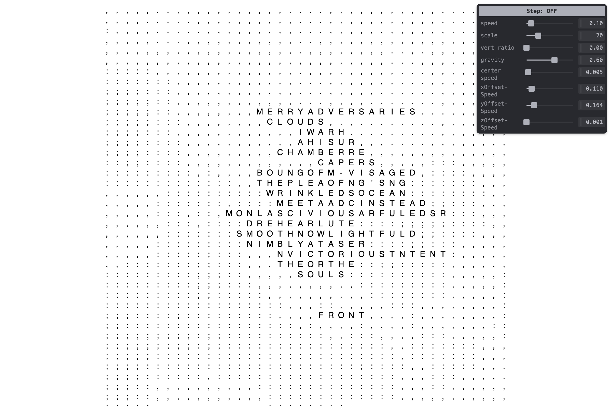

# aggressive-text-waves

Text animated on a character grid, driven by 2D Perlin noise. Words from a source text drift across the grid toward a wandering gravity well. Background cells fill with noise-selected punctuation characters.

**Live:** https://michaelpaulukonis.github.io/aggressive-text-waves/



## Controls

| Control | Description |
|---------|-------------|
| `C` | Toggle gravity center visualizer |
| Step button | Toggle single-step mode (advance one frame per click) |

## Tweakpane Parameters

| Parameter | Description |
|-----------|-------------|
| `speed` | Probability a word moves each frame (quadratic curve) |
| `scale` | Cell size in pixels; triggers grid reinit on change |
| `vert ratio` | Fraction of words placed vertically |
| `gravity` | Blend between personal noise target (0) and shared gravity well (1) |
| `center speed` | How fast the gravity well drifts |
| `xOffsetSpeed` / `yOffsetSpeed` / `zOffsetSpeed` | Noise offset advance rates |

## Dev

```bash
nx dev aggressive-text-waves   # http://localhost:5179
nx build aggressive-text-waves
nx deploy aggressive-text-waves
```

## Notes

- "Waves" in the name refers to 2D Perlin noise fields, not literal wave motion
- Ported from `my-sketches` canvas-sketch repo; canvas-sketch removed in favor of plain p5 instance mode
- Tweakpane v4 (`addBinding` API)
