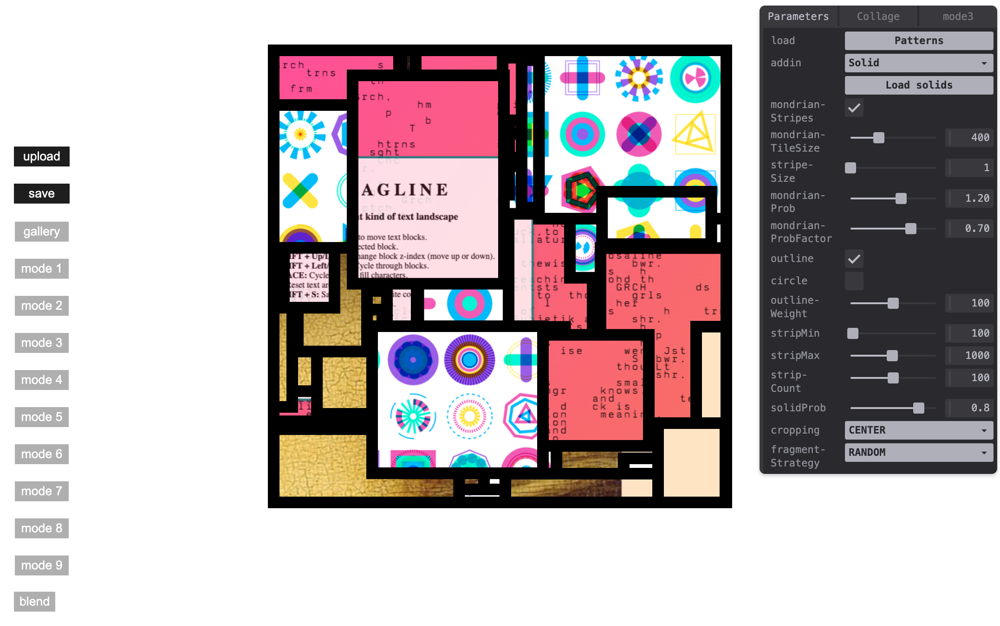
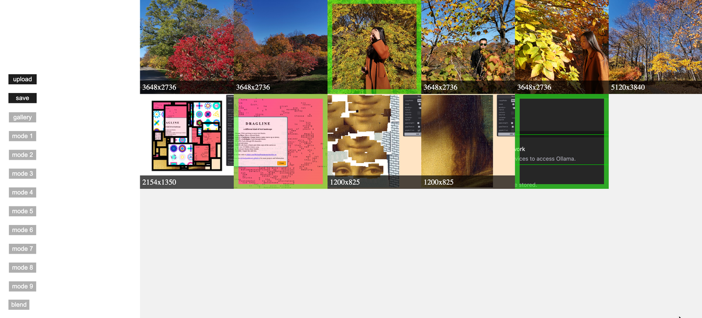

# Computational Collage

An advanced collage creation tool with multiple composition modes, image manipulation, and export capabilities.






## Features

- **10 Composition Modes**: From structured grids to organic arrangements
- **Interactive Controls**: Real-time parameter adjustment with Tweakpane
- **Image Management**: Drag & drop upload with gallery interface
- **High-Resolution Export**: 2400x2400 pixel output
- **Sound Integration**: Audio feedback for user actions

## Usage

### Basic Workflow

1. **Upload Images**: Drag & drop images or use the upload button
2. **Select Mode**: Press number keys 0-9 to switch between composition modes
3. **Adjust Parameters**: Use the parameter panel (press 'i' to toggle)
4. **Generate**: Each mode creates a unique composition from your images
5. **Export**: Press 's' to save the current composition

### Keyboard Controls

- **0-9**: Switch between composition modes
- **s**: Save current composition
- **g**: Toggle image gallery
- **b**: Toggle blend mode
- **u**: Upload new images
- **i**: Toggle parameter panel

### Composition Modes

0. **Image Gallery** - Browse and manage uploaded images
1. **Full-length Strips** - Horizontal strips across canvas
2. **Random Chunks** - Scattered image fragments
3. **Circular Arrangements** - Radial compositions
4. **Floating Pixels** - Pointillistic image particles
5. **Mondrian Boxes** - Recursive grid subdivision
6. **Free Strips** - Variable-height horizontal bands
7. **Mondrian Stripes** - Geometric stripe patterns
8. **Stretched** - Single image distortion
9. **Circle Splashes** - Concentric radial patterns

## Development

This project is part of the GenArt Monorepo. See the main README for setup instructions.

### Local Development

```bash
# From the monorepo root
nx dev computational-collage
```

The app will be available at http://localhost:5176

## Documentation

- [Development Notes](./docs/README.md) - Technical details and architecture
- [Original README](./docs/ORIGINAL_README.md) - Original project documentation