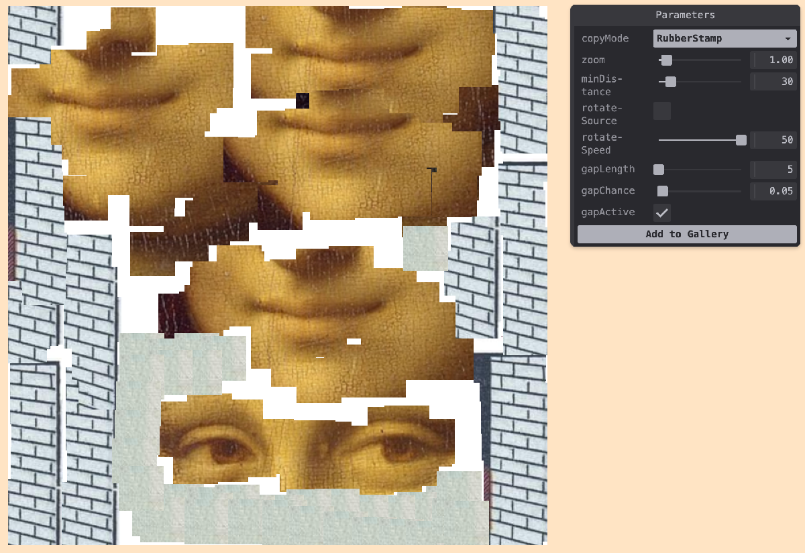

# Collage Painter

Interactive collage painting tool for creating digital art compositions.



Inspired by [Tim Rodenbroeker's Lowtech Painting Machine](https://timrodenbroeker.de/lowtech-painting-machine/)

**Live build:** <https://michaelpaulukonis.github.io/crude-collage-painter>

---

## Getting Started (Monorepo)

This project is part of the genart-monorepo. To work with crude-collage-painter:

### Prerequisites

- Node.js ≥ 18
- pnpm (workspace package manager)

### Installation

From the monorepo root:

```bash
pnpm install
```

### Quick Start

```bash
# Development server (port 5174)
nx dev crude-collage-painter

# Or from monorepo root
pnpm dev
```

Visit <http://localhost:5174> and start painting.

---

## Usage

### Core Interaction

Paint by moving your cursor across the canvas. The tool samples from source images and applies them as brush strokes, creating a collage effect.

| Action          | Gesture                |
| --------------- | ---------------------- |
| Paint           | Move cursor/drag mouse |
| Clear canvas    | `c`                    |
| Save image      | `s`                    |
| Toggle controls | `h`                    |

### Features

- **Image sampling** – Brush samples from loaded source images
- **Collage effect** – Creates painterly compositions from image fragments
- **Real-time painting** – Immediate visual feedback as you move the cursor
- **Export** – Save your compositions as PNG files

---

## Development Setup (Monorepo)

### Available Commands

| Command                            | Purpose                                                        |
| ---------------------------------- | -------------------------------------------------------------- |
| `nx dev crude-collage-painter`     | Start Vite dev server on port 5174                             |
| `nx build crude-collage-painter`   | Produce production bundle in `dist/apps/crude-collage-painter` |
| `nx preview crude-collage-painter` | Preview the production build locally                           |
| `nx lint crude-collage-painter`    | Run ESLint on crude-collage-painter code                       |
| `nx deploy crude-collage-painter`  | Deploy to GitHub Pages (original repository)                   |

### Workflow Notes

- Vite hot-module reload keeps the canvas responsive—no manual refresh needed
- For styling tweaks, edit `css/style.css`
- The app uses p5js-wrapper for module compatibility with p5.js

---

## Deployment

Crude Collage Painter maintains its original GitHub Pages deployment at <https://michaelpaulukonis.github.io/crude-collage-painter>.

To deploy from the monorepo:

```bash
# Build and deploy to original repository
nx build crude-collage-painter
nx deploy crude-collage-painter
```

The deploy command pushes the built files to the `gh-pages` branch of the original crude-collage-painter repository.

---

## Project Structure

```
apps/crude-collage-painter/
├── src/
│   ├── sketch.js           # Main p5.js sketch
│   └── utils.js            # Utility functions
├── css/
│   └── style.css           # Canvas and page styling
├── public/
│   └── images/             # Source images for painting
├── docs/
│   └── screenshots/        # App screenshots
├── index.html              # Entry point
├── package.json            # App dependencies
├── project.json            # Nx configuration
├── vite.config.js          # Vite build config
└── README.md               # This file
```

---

## Troubleshooting & FAQ

**Q: How do I add my own source images?**  
A: Place images in the `public/images/` directory and they'll be available for sampling.
A: open the gallery ('g') and drag images into it.

**Q: Can I adjust the brush size or behavior?**  
A: Yes, modify the brush parameters in `src/sketch.js` to customize the painting behavior.

**Q: Where can I ask questions?**  
A: Open a GitHub issue in the original repository or the monorepo.

---

## Additional Info

- **License:** MIT
- **Project Status:** Active development
- **Original Repository:** <https://github.com/MichaelPaulukonis/crude-collage-painter>
- **Monorepo:** Part of the genart-monorepo collection

---

## Credits & Resources

- Built with [p5.js](https://p5js.org/) and [Vite](https://vitejs.dev/)
- Inspired by [Tim Rodenbroeker's Lowtech Painting Machine](https://timrodenbroeker.de/lowtech-painting-machine/)

Happy painting! 🎨
