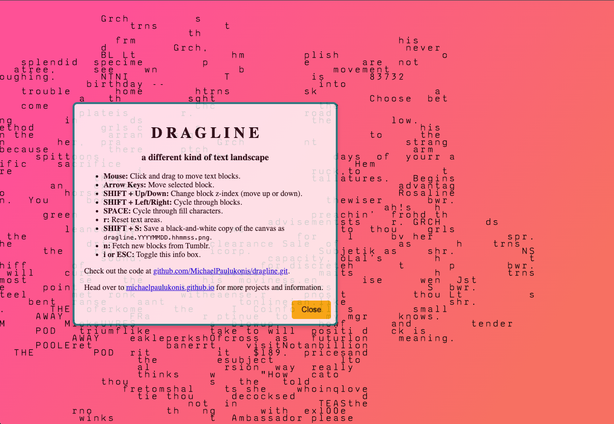

# dragline · a draggable text landscape

[](#project-status) [](LICENSE) [](package.json) [](https://vitejs.dev/)

Dragline is an interactive poem-machine that scatters monospaced text blocks across a canvas and invites you to rearrange them into new constellations. Every composition is a miniature collaboration between generative code, Tumblr-fueled corpora, and your hands on the mouse.



> "It's not so much a tool as it is a text of its own."

**Live build:** <https://michaelpaulukonis.github.io/dragline>

---

## Getting Started (Monorepo)

This project is part of the genart-monorepo. To work with dragline:

### Prerequisites

- Node.js ≥ 18
- pnpm (workspace package manager)
- Optional: Tumblr API key for custom text sources

### Installation

From the monorepo root:

```bash
pnpm install
```

### Quick Start

```bash
# Development server (port 5177)
nx dev dragline

# Or from monorepo root
pnpm dev
```

Visit <http://localhost:5177> and start rearranging blocks.

### Common Setup Hiccups

| Issue                             | Why it happens                    | Fix                                                                                                   |
| --------------------------------- | --------------------------------- | ----------------------------------------------------------------------------------------------------- |
| Port 5177 already in use          | Another dev server running        | Stop other servers or check with `lsof -i :5177`                                                      |
| Tumblr requests fail with 429/401 | Tumblr rate limits or key revoked | Dragline falls back to bundled JSON blocks; add your own API key in `src/tumblr-random.js` if needed. |
| Canvas looks empty                | Fallback data not loaded yet      | Wait a moment or press **`n`** to fetch a new batch.                                                  |

---

## Usage

### Core Interaction

| Action                            | Gesture                                       |
| --------------------------------- | --------------------------------------------- |
| Move a block                      | Click + drag                                  |
| Add a block                       | Right arrow                                   |
| Remove the most recent block      | Left arrow                                    |
| Delete selected block             | Delete/Backspace                              |
| Raise/lower z-index               | Shift + Up / Shift + Down                     |
| Cycle focus between blocks        | Shift + Left / Shift + Right                  |
| Cycle fill characters             | Space                                         |
| Reset layout                      | `r`                                           |
| Fetch fresh Tumblr corpus         | `n`                                           |
| Throw all blocks into motion      | `m` (Shift + `M` cycles strategy)             |
| Toggle burst-recording mode       | `R`                                           |
| Toggle info box                   | `i` or Escape                                 |
| Enter selection mode              | Option/Alt + Shift + `S`                      |
| Save crop while in selection mode | Shift + `S` or Enter                          |
| Save full monochrome canvas       | Shift + `S` (when selection mode is inactive) |

### Burst-Frame Recording

Press `R` to arm burst-recording. While armed, every `m` burst saves each frame to disk via the local save server (falls back to browser downloads if the server is off), named `dragline.burst-<id>.frame-NNNN.png`.

- `<id>` is assigned once, when you press `R` on — every `m` burst until you press `R` off shares that id.
- `frame-NNNN` counts continuously across all bursts in that same `R` on/off session, so the run stitches together as one sequence (e.g. for video).
- Press `R` again to disarm; the next `R` on starts a new id and resets the frame count.

### Advanced Play

- Edit the fill character palette in `src/dragline.js` (`fillChars`) for noisier or calmer compositions.
- Swap in your own fallback corpus by replacing `src/grids.*.json` with exported grids from previous sessions.
- Tweak clustering distance inside `src/blocks.js` to tighten or loosen the initial scatter.

### Configuration & Environment

The default Tumblr credentials in `src/tumblr-random.js` are public. To use your own key:

```js
const settings = {
  blogName: "your-blog.tumblr.com",
  appKey: import.meta.env.VITE_TUMBLR_KEY,
  debug: false,
};
```

Add the key to a `.env` file in the app directory and expose it via `VITE_TUMBLR_KEY`. Remember that Vite embeds variables starting with `VITE_` at build time.

---

## Features & Capabilities

### What's delightful right now

- 🎲 **Generative scatter** – Every load throws text fragments into a unique constellation.
- 📐 **Grid-snapped crops** – Define a reusable selection rectangle and export consistent captures.
- 🖱️ **Direct manipulation** – Drag blocks, layer them, and watch characters compete for canvas space.
- 🎚️ **On-the-fly remixing** – Cycle fill characters, reset layouts, or grab a high-contrast PNG snapshot.
- 🔄 **Live corpora** – Pull fresh text from Tumblr or lean on bundled archives when offline.

### Why Dragline is different

Unlike traditional text editors or poetry bots, Dragline treats text as spatial material. It rewards playful rearrangement and gives immediate visual feedback through z-index layering and grid-based rendering.

---

## Development Setup (Monorepo)

### Available Commands

| Command               | Purpose                                           |
| --------------------- | ------------------------------------------------- |
| `nx dev dragline`     | Start Vite dev server on port 5177                |
| `nx build dragline`   | Produce production bundle in `dist/apps/dragline` |
| `nx preview dragline` | Preview the production build locally              |
| `nx lint dragline`    | Run ESLint on dragline code                       |
| `nx deploy dragline`  | Deploy to GitHub Pages (original repository)      |

### Workflow Notes

- Vite hot-module reload keeps the canvas responsive—no manual refresh needed.
- For styling tweaks, edit `css/style.css` and `css/infobox.css`; no frameworks are involved.
- The app uses p5js-wrapper for module compatibility with p5.js.

### Debugging Tips

- Enable `debug: true` in `src/tumblr-random.js` to log API responses.
- Use the browser console to inspect `textAreas` and experiment with manual block mutations.
- Set breakpoints inside `populateCharGrid` to understand layering behaviour.

---

## Deployment

Dragline maintains its original GitHub Pages deployment at <https://michaelpaulukonis.github.io/dragline>.

To deploy from the monorepo:

```bash
# Build and deploy to original repository
nx build dragline
nx deploy dragline
```

The deploy command pushes the built files to the `gh-pages` branch of the original dragline repository.

---

## Project Structure

```
apps/dragline/
├── src/
│   ├── dragline.js         # p5 orchestration: fetch, input, rendering
│   ├── blocks.js           # Block creation, positioning, z-indexing
│   ├── grid.js             # Character grid creation and rendering helpers
│   ├── selection.js        # Grid-snapped selection state + overlay rendering
│   ├── infobox.js          # Info panel toggle logic
│   ├── tumblr-random.js    # Tumblr API integration + fallback logic
│   ├── grids.*.json        # Fallback text data
│   └── text-grid/          # Tokenize → gridify → split corpus
│       ├── index.js
│       ├── gridBuilder.js
│       ├── splitter.js
│       ├── tokenizer.js
│       └── utils/
│           └── helpers.js
├── css/
│   ├── style.css           # Base canvas and page styling
│   └── infobox.css         # Floating instructions panel
├── public/
│   ├── favicon.ico
│   └── saxmono.ttf         # Monospace font
├── docs/                   # Documentation and backlog
├── index.html              # Entry point
├── package.json            # App dependencies
├── project.json            # Nx configuration
├── vite.config.js          # Vite build config
└── README.md               # This file
```

---

## Troubleshooting & FAQ

**Q: The canvas is blank—did something break?**  
A: Probably not. Press `n` to fetch a new set of blocks or check the console for Tumblr rate-limit messages.

**Q: Can I use my own text source?**  
A: Absolutely. Point `blogName` in `src/tumblr-random.js` to another Tumblr blog or swap the fetch entirely for local files.

**Q: How do I capture a composition without the pink gradient?**  
A: Press Shift + `S` for a full-canvas monochrome PNG. Need a specific crop? Press Option/Alt + Shift + `S` to enter selection mode, adjust the grid-snapped bounds, then confirm with Shift + `S` or Enter to export just that region.

**Q: Where can I ask questions?**  
A: Open a GitHub issue in the original repository or the monorepo.

---

## Additional Info

- **License:** MIT
- **Project Status:** In development; expect playful instability.
- **Original Repository:** <https://github.com/MichaelPaulukonis/dragline>
- **Monorepo:** Part of the genart-monorepo collection

---

## Credits & Resources

- Built with [p5.js](https://p5js.org/) and [Vite](https://vitejs.dev/).
- Tumblr corpus courtesy of <https://poeticalbot.tumblr.com> (and whatever blog you plug in).
- Inspiration and ongoing architectural notes live inside [`docs/reference/`](docs/reference/).

Happy dragging! 🐛
