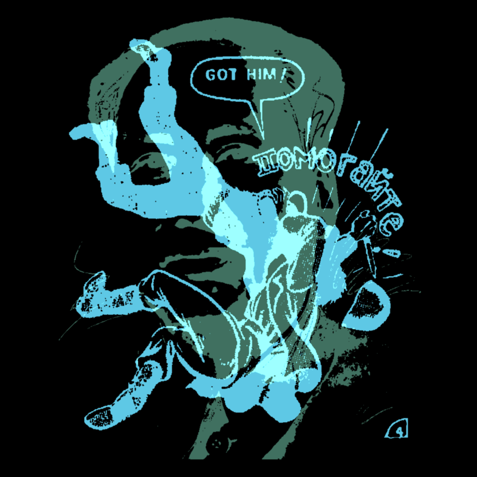

# DUO-CHROME

Overlays two monochrome images in different colors to create duotone compositions. Inspired by [Lee Doughty's work](https://leedoughty.com/) and RISO printing.

[](https://opensource.org/licenses/MIT)



**Live build:** <https://michaelpaulukonis.github.io/duo-chrome>

Takes two random black & white images from a curated collection, applies different RISO colors to each, and composites them using various blend modes. Images cycle automatically or manually to create unexpected juxtapositions.

## Table of Contents

- [Getting Started](#getting-started)
- [Controls](#controls)
- [Development](#development)
- [How It Works](#how-it-works)
- [Project Structure](#project-structure)
- [Deployment](#deployment)
- [Contributing](#contributing)
- [License](#license)

## Getting Started (Monorepo)

This project is part of the genart-monorepo. To work with duo-chrome:

### Prerequisites

- Node.js ≥ 18
- pnpm (workspace package manager)

### Installation

From the monorepo root:

```bash
pnpm install
```

### Quick Start

```bash
# Development server (port 5173)
nx dev duo-chrome

# Or from monorepo root
pnpm dev
```

Visit <http://localhost:5173> to view the app.

## Controls

| Input        | Action                                |
| ------------ | ------------------------------------- |
| Mouse Click  | Generate new image combination        |
| `b`          | Toggle background color (black/white) |
| `c`          | Cycle through color palettes          |
| `m`          | Cycle through blend modes             |
| `p` or Space | Pause/resume auto-generation          |
| `S`          | Toggle auto-save mode                 |
| `Cmd+S`      | Save current composition              |
| `H` or `I`   | Toggle help overlay                   |

### Help Overlay

Press `H` or `I` to open the help overlay, which displays:
- Complete keyboard shortcuts reference  
- Current application version
- Usage instructions

The help overlay can be closed by pressing `H`, `I`, or `ESC`.

## Development

### Available Commands

| Command                 | Purpose                                      |
| ----------------------- | -------------------------------------------- |
| `nx dev duo-chrome`     | Start Vite dev server on port 5173           |
| `nx build duo-chrome`   | Produce production bundle                    |
| `nx preview duo-chrome` | Preview the production build locally         |
| `nx lint duo-chrome`    | Run ESLint on duo-chrome code                |
| `nx deploy duo-chrome`  | Deploy to GitHub Pages (original repository) |

### Workflow Notes

- Vite hot-module reload keeps the canvas responsive—no manual refresh needed
- Uses StandardJS code style and ESLint with p5.js rules
- The app uses p5js-wrapper for module compatibility with p5.js

### Adding Images

1. Add image to `public/images/`
2. Update `imgs` array in `src/imagelist.js`
3. Works best with high-contrast black and white graphics

### Adding Colors

Edit `src/risocolors.js`:

```javascript
export const CUSTOM_PALETTE = [
  { name: "CUSTOM_COLOR", color: [255, 100, 50] },
  // ...
];
```

## How It Works

1. Randomly selects two images from the collection
2. Converts each to monochrome layers
3. Applies different RISO colors via `globalCompositeOperation = 'source-in'`
4. Composites using blend modes (ADD, MULTIPLY, EXCLUSION, etc.)
5. Images overlap in sequence (A+B, C+B, C+D) for visual continuity

### Core Algorithm

```javascript
// Simplified version of the core process
function createMonochromeImage(img, monoColor) {
  const layer = p.createGraphics(scaledWidth, scaledHeight);
  layer.image(img, 0, 0, scaledWidth, scaledHeight);
  layer.drawingContext.globalCompositeOperation = "source-in";
  layer.image(colorLayer, 0, 0, scaledWidth, scaledHeight);
  return layer;
}
```

## Project Structure

```
apps/duo-chrome/
├── src/
│   ├── duo-chrome.js     # Main p5.js sketch
│   ├── imagelist.js      # Image inventory (~160 files)
│   └── risocolors.js     # Color palettes
├── public/
│   └── images/           # Curated image collection
├── css/
│   └── style.css         # Canvas and page styling
├── docs/
│   └── screenshots/      # App screenshots
├── index.html            # Entry point
├── package.json          # App dependencies
├── project.json          # Nx configuration
├── vite.config.js        # Vite build config
└── README.md             # This file
```

## Deployment

Duo-chrome maintains its original GitHub Pages deployment at <https://michaelpaulukonis.github.io/duo-chrome>.

To deploy from the monorepo:

```bash
# Build and deploy to original repository
nx build duo-chrome
nx deploy duo-chrome
```

The deploy command pushes the built files to the `gh-pages` branch of the original duo-chrome repository.

## Contributing

PRs welcome. Follow StandardJS style.

## Additional Info

- **License:** MIT
- **Project Status:** Active development
- **Original Repository:** <https://github.com/MichaelPaulukonis/duo-chrome>
- **Monorepo:** Part of the genart-monorepo collection
