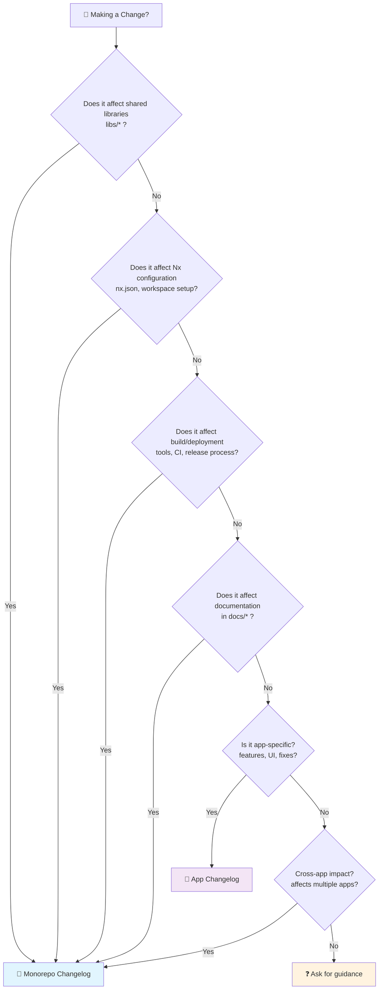

# Changelog Routing Decision Matrix

## Quick Decision Flowchart



## Visual Decision Matrix

| 🔍 Question | ✅ Yes → Route To | ❌ No → Continue |
|-------------|------------------|------------------|
| **Does the change affect shared libraries** (`libs/*`)? | 📝 **Monorepo Changelog** | ⬇️ Next Question |
| **Does it modify Nx configuration** (`nx.json`, workspace settings)? | 📝 **Monorepo Changelog** | ⬇️ Next Question |
| **Does it affect build/deployment** (CI, tools, release process)? | 📝 **Monorepo Changelog** | ⬇️ Next Question |
| **Does it modify workspace documentation** (`docs/*`)? | 📝 **Monorepo Changelog** | ⬇️ Next Question |
| **Is it an app-specific change** (features, UI, fixes)? | 📱 **App Changelog** | ⬇️ Next Question |
| **Does it have cross-app impact** (affects multiple apps)? | 📝 **Monorepo Changelog** | ❓ **Ask for guidance** |

## 🎯 Quick Reference by File Path

### 📝 Monorepo Changelog (`/CHANGELOG.md`)
- `libs/` - Any shared library changes
- `nx.json` - Nx workspace configuration
- `package.json` (root) - Workspace dependencies
- `docs/` - Workspace-wide documentation
- `tools/` - Build tools and utilities
- `scripts/` - Workspace scripts
- `.github/` - CI/CD, templates, workflows

### 📱 App Changelog (`apps/[app]/CHANGELOG.md`)
- `apps/[specific-app]/` - App-specific changes
- App features, UI improvements, bug fixes
- App-specific documentation
- App-specific dependencies

## 🧩 Edge Cases and Examples

### **Case 1: Shared Library + App Integration**
**Scenario**: Adding a new function to `libs/p5-utils` and updating `duo-chrome` to use it

**Decision**: 
- **Primary**: 📝 Monorepo Changelog (shared library impact)
- **Optional**: 📱 App Changelog (significant app behavior change)

**Example**:
```bash
feat(libs/p5-utils): add pressure-sensitive drawing function

- Add new pressureDraw() utility for touch/stylus input
- Update duo-chrome integration to support pressure sensitivity
```

### **Case 2: Breaking Change Across Apps**
**Scenario**: Updating shared color palette API that affects multiple apps

**Decision**: 📝 Monorepo Changelog (cross-app breaking change)

**Example**:
```bash
feat(libs/color-palettes)!: update palette API for consistency

BREAKING CHANGE: getPalette() now returns objects instead of arrays
- Updated duo-chrome, crude-collage, and computational-collage to use new API
```

### **Case 3: App-Specific Documentation**
**Scenario**: Updating `apps/duo-chrome/docs/user-guide.md`

**Decision**: 📱 App Changelog (app-specific documentation)

**Example**:
```bash
docs(duo-chrome): update user guide with new keyboard shortcuts
```

### **Case 4: Cross-App Documentation**
**Scenario**: Updating `docs/architecture/overview.md`

**Decision**: 📝 Monorepo Changelog (workspace documentation)

**Example**:
```bash
docs(monorepo): update architecture overview with new shared components
```

## 🏷️ Keyword-Based Auto-Detection

The workspace changelog aggregator automatically detects entries containing these keywords:

### Infrastructure Keywords
- `nx.json`, `nx`, `monorepo`, `workspace`
- `libs/`, `lib/`, `docs/`
- `build`, `ci`, `deploy`, `release`, `version`
- `chore(release)`

### When Keywords Conflict
If your commit message contains infrastructure keywords but the change is app-specific:

**Good**: Use clear scoping
```bash
feat(duo-chrome): add build optimization for this app specifically
```

**Avoid**: Ambiguous scoping that might trigger auto-aggregation
```bash
feat: optimize build process
# ^ This might be auto-aggregated to monorepo changelog
```

## 🔧 Manual Override Process

When the automatic classification doesn't match your intent:

1. **After committing**: Manually edit the appropriate changelog
2. **Re-run aggregator**: `pnpm gen:changelog:apply` to update workspace changelog
3. **Document reason**: Add a note in the changelog explaining the override

## 🚨 Common Mistakes to Avoid

| ❌ Don't Do This | ✅ Do This Instead | Why |
|------------------|-------------------|-----|
| `feat: add new feature` | `feat(duo-chrome): add color cycling` | Scope indicates routing |
| `fix(monorepo): fix duo-chrome bug` | `fix(duo-chrome): resolve color issue` | Bug is app-specific |
| `docs: update readme` | `docs(duo-chrome): update app readme` | Specify which readme |
| Multiple changes in one commit | Separate commits by changelog type | Easier to route correctly |

## 📊 Decision Statistics

Use this checklist to validate your decision:

- [ ] **File paths reviewed**: What files are being modified?
- [ ] **Impact scope assessed**: One app or multiple/shared?
- [ ] **Change type identified**: Feature, fix, docs, refactor, etc.
- [ ] **Keywords considered**: Does the commit message contain routing keywords?
- [ ] **Future developers**: Will they look in the right changelog?

---

## 📞 When in Doubt

If you're still unsure after going through this matrix:

1. **Ask the team**: Post in development chat with your scenario
2. **Default to app-specific**: If truly uncertain, err toward app changelog
3. **Document the decision**: Add a note explaining your reasoning
4. **Update this matrix**: If you discover a new edge case, add it here

Remember: The goal is **developer productivity** and **clear communication** - when in doubt, choose the location where future developers will most likely look for information about your change.